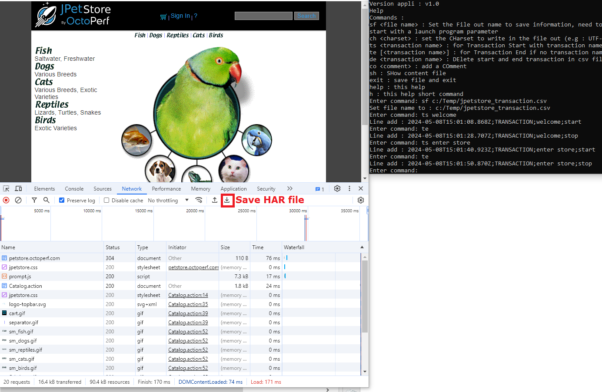
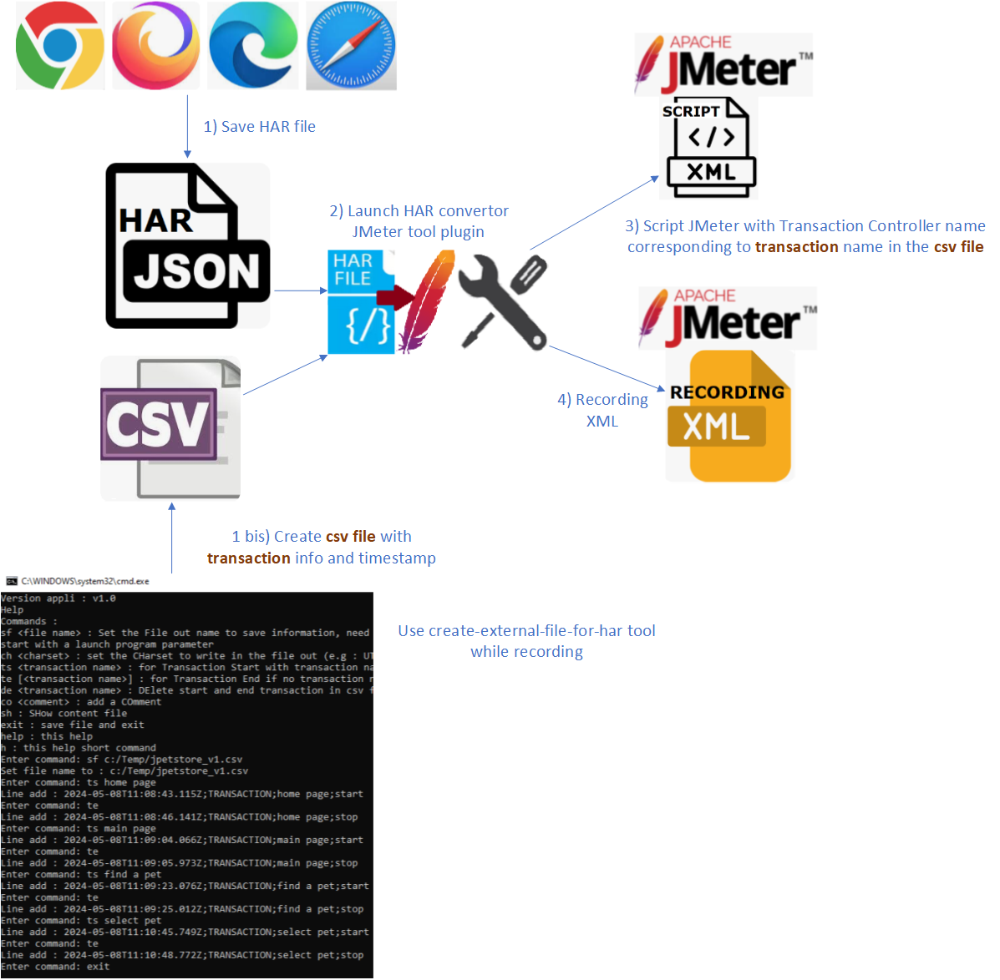

  
Create a csv file with transaction information to complete a HAR (Http ARchive) file.

  
<a href="https://github.com/vdaburon/create-external-file-for-har">Link to github project create-external-file-for-har</a>

# create-external-file-for-har
Console text tool to create transaction info corresponding to a har file.

Create a csv file with transaction information to complete a HAR (Http ARchive) file.

The csv format is : TIME_STAMP ISO GMT;ELEMENT;NAME;TYPE 
- Timestamp ISO GMT format
- ELEMENT values are : <code>TRANSACTION</code> or <code>COMMENT</code>
- TYPE for transaction, values are : <code>start</code> or <code>stop</code>
- CSV separtor : ";"
- Charset : "UTF-8"

E.g :
<pre>
2024-05-07T07:56:40.513Z;TRANSACTION;authent;start
2024-05-07T07:56:56.261Z;TRANSACTION;authent;stop
2024-05-07T07:57:08.679Z;TRANSACTION;home;start
2024-05-07T07:57:10.123Z;COMMENT;user toto;
2024-05-07T07:57:14.310Z;TRANSACTION;home;stop
2024-05-07T07:57:30.280Z;TRANSACTION;logout;start
2024-05-07T07:58:15.377Z;TRANSACTION;logout;stop
</pre>

## Launch the tool 
This tool could be use with script shell Windows or Linux.
<pre>
C:\mydir>java -jar -Dfile.encoding=UTF-8 -jar ../target/create-external-file-for-har-1.0-jar-with-dependencies.jar
</pre>

With set file out parameter :
<pre>
C:\mydir>java -jar -Dfile.encoding=UTF-8 -jar ../target/create-external-file-for-har-1.0-jar-with-dependencies.jar c:/temp/demo1.csv
</pre>

## Help
Command help or h display :

<pre>
Help
Commands : 
sf &lt;file name&gt; : Set the File out name to save information, need to be first command or the file name is set at program start with a launch program parameter
ch &lt;charset&gt; : set the CHarset to write in the file out  (e.g : UTF-8 (Default) or ISO-8859-1 or Cp1252 (windows))
ts &lt;transaction name&gt; : for Transaction Start with transaction name not empty
te [&lt;transaction name&gt;] : for Transaction End if no transaction name then use the last transaction name
de &lt;transaction name&gt; : DElete start and end transaction in csv file or a comment
co &lt;comment&gt; : add a COmment
sh : SHow content file
exit : save file and EXIT
help : this HELP
h : this Help short command
</pre>

## How use this tool while recording a HAR file when navigate to web site

Record a HAR file and create external csv file with create-external-file-to-har tool.

For Chrome Browser (**B** for Browser) :  
B1) Open navigator (Chrome)  
B2) Open dev tools with &lt;F12&gt;  
B3) Tab "Network"   
B4) Record button is ON.   
B5) "Preserve log" is checked. (Optional) If needed, delete the exchanges before browsing   
   
Start create-external-file-for-har tool (**C** for Create external file tool)   
C1) Set a file name , command : sf c:/Temp/jpetstore_transaction.csv  
 
C2) Create the first transaction start, command : ts welcome   
B6) Navigate to the home url in the Browser   
C3) When the page is display, end the first transaction (welcome), command : te   
 
C4) Create a new transaction for future page, command : ts enter store   
B7) Click on link or click on button to navigate to store page   
C5) When the page is display, end the current transaction (store page), command : te   
 
C4) Create a new transaction for future page, command : ts page3  
B8) Click on link or click on button to navigate to the page3  
C5) When the page is display, end the current transaction (page3), command : te  
 
C6) Create a new transaction for futur page ou form, command : ts &lt;page name&gt;  
B9) Navigate to the page  
C7) When the page is display, end the current transaction (page name), command : te  
 
... continue to create a transaction before navigate, navigate to the page, end the transaction ...  
 
Bx) When navigation is finished, Save exchanges in HAR format "Export HAR ..."  

## Companion tool
The csv file created will be used by this other tool : "har-to-jmeter-convertor"
https://github.com/vdaburon/har-to-jmeter-convertor

or this JMeter plugin "har-convertor-jmeter-plugin"
https://github.com/vdaburon/har-convertor-jmeter-plugin

## JPetstore web application
This example use the JPetstore from Octoperf : https://petstore.octoperf.com/

## License
Licensed under the Apache License, Version 2.0

## Versions
Version 1.0 date 2024-05-10, First version
